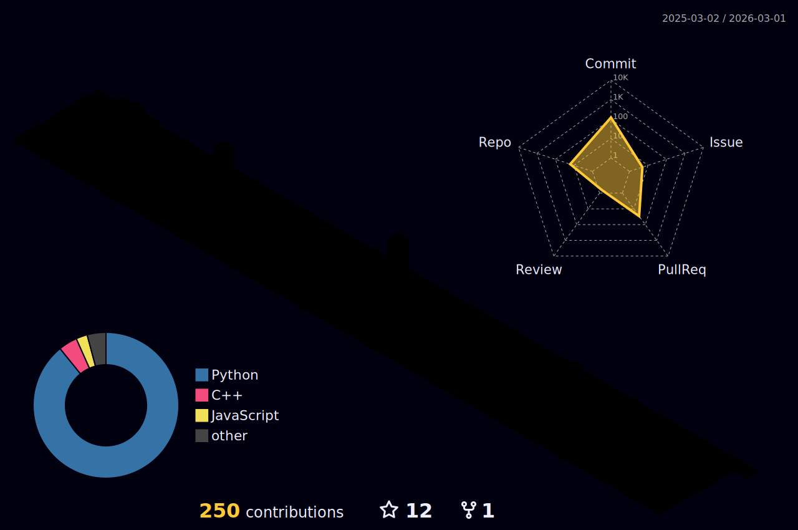

## 🎫 Career 🎟
✓ 2021.01.01 ~ 2023.08.31 : 세종대학교 AISL 학부연구생  
✓ 2023.09.01 ~ : 세종대학교 AISL 석사과정  
🙂 2024.06.26 ~ 2024.12.19 : 영국 Coventry 대학교 Visiting Researcher  

## 🏆 Awards 🏆
🏅 2021.05.18 : [EU-Korea Intelligent IoT oneM2M Hackathon] - 3rd Prize  
🥇 2022.11.29 : [International oneM2M Hackathon (Extension of 5th Mobius developer event)](https://www.hackster.io/blossom/fire-situation-monitoring-system-through-connection-with-dt-365f98) - 1st Prize (Minister of Science and ICT Award)

---

  

## 📹 My Projects on YouTube 🚀  

## 📹 My Projects on YouTube 🚀  

### 🚁 Drone & Robotics Projects  

  

# 🚀 Tech Stack 🚀

### 🖥️ Programming Languages & Web 🐍✨  

### 🤖 AI, Machine Learning & Data Science 🧠💡  

### 🤖 Robotics & Embedded Systems  

  

### 🔨 Development & DevOps  

### 🎨 3D Modeling & CAD  

 

  
  

 

  

