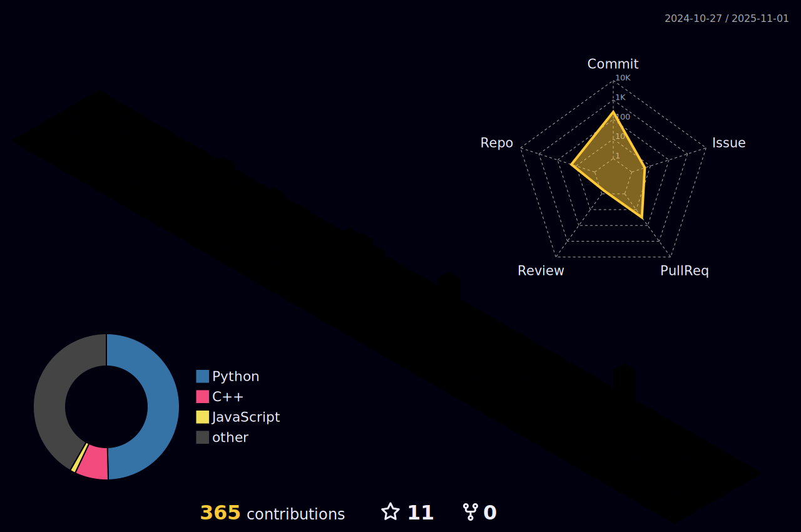

<h3 align="left"><b>🛠 Tech Stack 🛠</b></h3>

 

</a> &nbsp
</a> &nbsp
</a> &nbsp 
</a> &nbsp
</a> &nbsp         

<h3 align="left"><b>🛠 📕 I'm studying ... 📕 🛠</b></h3>

 

</a> &nbsp
</a> &nbsp
</a> &nbsp 
</a> &nbsp
</a> &nbsp

        

<!-- 프로필 세부 정보 -->

<!-- 상위 언어 그래프 (가로 50:50) -->

  
  

<!-- 통계 정보 (가로 50:50) -->

  
  

<h3 align="left"><b>🗒 Experiences 🗒 </b></h3> 

| Experiences | Year |
| :-------------------------------- | :----------: |
| 세종대학교 AISL 학부연구생 | |
| EU-Korea Intelligent IoT oneM2M Hackathon-동상 | 2021 |

